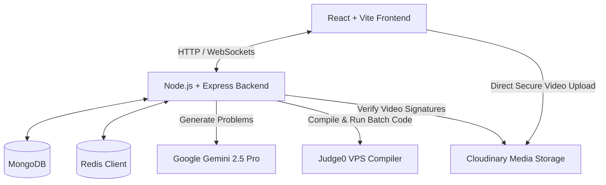
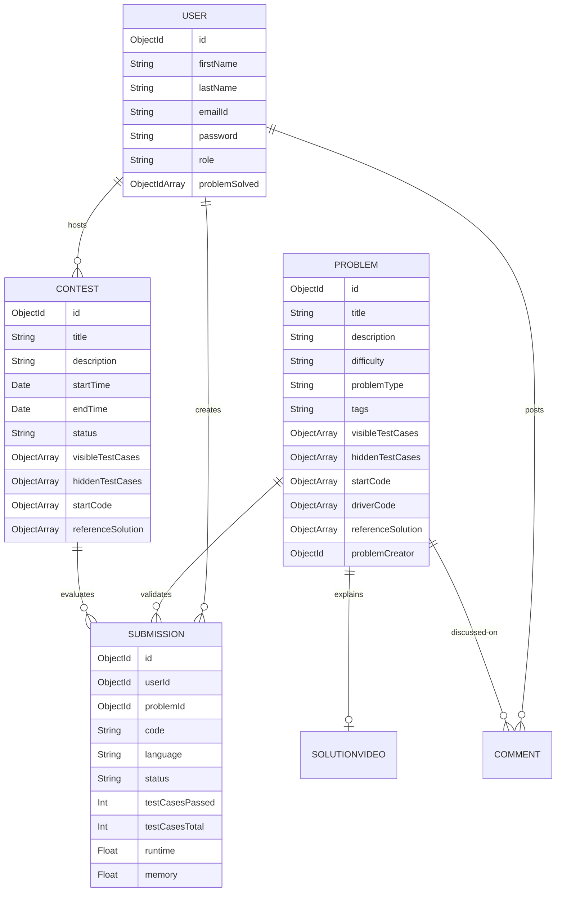

# 🚀 Codezy - LeetCode-Style Online Judge & Competitive Programming Platform

Codezy is a feature-rich, high-performance competitive programming and interactive learning platform. It allows users to write, compile, run, and submit code against test cases in real-time, generate fresh situational coding problems using AI, upload and watch video editorials, and participate in competitive coding contests with real-time leaderboards and user-solving broadcasts.

---

## 🏗️ Architecture Overview

The system is built as a split client-server architecture utilizing **MongoDB** for storage, **Redis** for performant token blacklist management & database caching, **Socket.io** for real-time broadcasts, **Google Gemini 2.5 Pro** for AI content generation, and a dedicated **Judge0 VPS** instances for isolated code execution.



---

## 🌟 Key Features

### 1. 🖥️ LeetCode-Style Integrated Code Sandbox
* **Interactive Workspace**: Built with [ProblemPage.jsx](file:///Users/prasanna/developer/final_code/frontend/src/pages/ProblemPage.jsx) featuring clean split panes and resizable layouts.
* **Modern Editor**: Employs Monaco Editor (`@monaco-editor/react`) and CodeMirror with syntax highlighting, autocomplete, and indentation rules.
* **Multi-Language Support**: Supports coding in **JavaScript**, **C++**, and **Java** with pre-populated starter function templates.

### 2. ⚙️ Secure Code Compilation & Evaluation
* **Judge0 Sandbox Sandbox**: Code execution runs securely inside isolated Judge0 environments.
* **Run & Submit Modes**: 
  * *Run Code*: Compiles and validates logic against visible test cases.
  * *Submit Code*: Evaluates code against hidden edge cases and saves performance metrics (runtime, memory usage).
* **Driver Code Wrapper**: Automatically wraps user-implemented function methods inside standardized header and footer boilerplate inputs handled by [userSubmission.js](file:///Users/prasanna/developer/final_code/backend/src/controllers/userSubmission.js).

### 3. 🤖 Gemini-Powered AI Problem Generator
* **Automatic Creation**: Harnesses Gemini 2.5 Pro in [generateProblem.js](file:///Users/prasanna/developer/final_code/backend/src/controllers/generateProblem.js) to dynamically compile situation-based DSA questions.
* **Instant Insertion**: Users select difficulty and topic (`Array`, `Linked List`, `Graph`, `DP`), and the backend inserts a structured problem containing starter codes, driver setup, and test cases directly into the judge database.
* **UI Controls**: Driven by the custom [ChatAi.jsx](file:///Users/prasanna/developer/final_code/frontend/src/components/ChatAi.jsx) component.

### 4. 🏆 Real-Time Competitive Contests & Leaderboards
* **Contest Engine**: Enables admins to schedule coding contests via [contest.js](file:///Users/prasanna/developer/final_code/backend/src/routes/contest.js) and [createContest.js](file:///Users/prasanna/developer/final_code/backend/src/controllers/createContest.js).
* **Live Timers**: Provides active count-downs and synchronized starts.
* **Interactive Leaderboard**: Automatically ranks participants in real-time based on test cases passed, runtime speed, and points accrued.

### 5. 👥 Collaborative Community Features
* **Live Broadcast Toasts**: Instantly notifies active users when a peer successfully solves a problem using Socket.io server listeners in [index.js](file:///Users/prasanna/developer/final_code/backend/src/index.js#L59-L82) and triggers client-side toasts in [App.jsx](file:///Users/prasanna/developer/final_code/frontend/src/App.jsx#L45-L54).
* **Interactive Comments**: Threaded discussion logs per coding problem.
* **Video Editorial Hub**: Admins and creators upload walkthrough videos via Cloudinary. The backend handles secure api signature generation and resource verification under [videoSection.js](file:///Users/prasanna/developer/final_code/backend/src/controllers/videoSection.js).
* **Peer Bug Reporting**: Directly integrated issue reporting tool using EmailJS.

### 6. 🔐 Robust Sessions & Session Control
* **Dual Auth Strategies**: Email/Password registrations alongside Passport Google OAuth 2.0.
* **Redis JWT Blocklist**: Upon logout, JWT tokens are blocklisted in Redis with automatic TTL expiry to prevent unauthorized reuse.
* **Special AI Rate-Limiting**: Tracked via JWT-signed session limits (enforced to 2 uses per session via [featureMiddleware.js](file:///Users/prasanna/developer/final_code/backend/src/middleware/featureMiddleware.js)).

---

## 🛠️ Tech Stack

### Frontend ([frontend](file:///Users/prasanna/developer/final_code/frontend))
* **Build tool & Library**: Vite + React (v19)
* **Styling**: Tailwind CSS (v4) + DaisyUI
* **State Management**: Redux Toolkit (auth state persistence)
* **Real-time connectivity**: Socket.io-client
* **Interactive components**: Monaco Editor, CodeMirror, React Resizable Panels, Chart.js, React Confetti, Lucide React icons, and GSAP.

### Backend ([backend](file:///Users/prasanna/developer/final_code/backend))
* **Server Framework**: Node.js + Express (v5)
* **Database**: MongoDB (Mongoose Object Modeling)
* **Caching & Security Layer**: Redis
* **Third Party Integrations**: 
  * Google Gemini API (`@google/genai`) for problem synthesis.
  * Judge0 batch API for code compilation and execution.
  * Cloudinary API for solution video assets storage.
  * Passport.js & JSONWebToken for authorization.

---

## 📁 Repository Structure

```text
├── backend/
│   ├── src/
│   │   ├── config/          # DB, Passport, and Redis client setups
│   │   ├── controllers/     # Authentication, Contest, and Code evaluation handlers
│   │   ├── middleware/      # Rate-limiting, Admin check, and User authentication
│   │   ├── models/          # MongoDB Mongoose schemas
│   │   ├── routes/          # Express route endpoints mapping controllers
│   │   ├── utils/           # Base64 converters and Judge0 batch execution helper
│   │   └── index.js         # Backend server gateway and WebSocket manager
│   ├── .env.example
│   └── package.json
├── frontend/
│   ├── public/
│   ├── src/
│   │   ├── assets/
│   │   ├── components/      # Modular UI components (ChatAi, Comment, Profile, etc.)
│   │   ├── pages/           # Core layout views (IDE Sandbox, Leaderboard, Contests)
│   │   ├── socket/          # Socket.io connection instantiator
│   │   ├── store/           # Redux store config
│   │   ├── authSlice.js     # User authentication actions & slice
│   │   └── App.jsx          # Route configurations and socket dispatch hooks
│   ├── .env.example
│   └── package.json
└── README.md                # Project documentation
```

---

## ⚙️ Environment Configuration

To configure the application, create a `.env` file in both `backend` and `frontend` directories using the reference templates below:

### Backend `.env`
```env
NODE_ENV=development
PORT=3000

# Databases
DB_CONNECT_STRING=your_mongodb_connection_url
REDIS_PASS=your_redis_password

# Authentication Secrets
JWT_KEY=your_secure_jwt_signing_key
GOOGLE_CLIENT_ID=your_google_oauth_client_id
GOOGLE_CLIENT_SECRET=your_google_oauth_client_secret
GOOGLE_CALLBACK_URL=http://localhost:3000/user/auth/google/callback
CLIENT_URL=http://localhost:5173

# AI & Third Party APIs
GEMINI_KEY=your_google_gemini_api_key
CLOUDINARY_CLOUD_NAME=your_cloudinary_cloud_name
CLOUDINARY_API_KEY=your_cloudinary_api_key
CLOUDINARY_API_SECRET=your_cloudinary_api_secret

# Code Judge Compilers
JUDGE0_API_KEY=your_judge0_api_key
JUDGE0_VPS_URL=http://your_vps_ip_address:2358
```

### Frontend `.env`
```env
# EmailJS parameters for Bug Report Feature
VITE_EMAILJS_PUBLIC_KEY=your_emailjs_public_key
VITE_EMAILJS_SERVICE_ID=your_emailjs_service_id
VITE_EMAILJS_TEMPLATE_ID=your_emailjs_template_id
```

---

## 🔌 API Route Reference

### 1. Authentication & Profile Routes (`/user`)
Managed in [userAuth.js](file:///Users/prasanna/developer/final_code/backend/src/routes/userAuth.js).
* `POST /user/register`: Registers a new user account.
* `POST /user/login`: Logs in using credentials.
* `POST /user/logout`: Standard credentials logout (blocklists token in Redis).
* `GET /user/auth/google`: Initiates Google OAuth sequence.
* `GET /user/profile`: Fetches current logged-in profile metrics.
* `POST /user/comment/:id`: Submits discussion comment on a problem.

### 2. Code Problems Management (`/problem`)
Managed in [problemCreator.js](file:///Users/prasanna/developer/final_code/backend/src/routes/problemCreator.js).
* `POST /problem/create`: Submits and creates a coding problem (Admin & User).
* `PUT /problem/update/:id`: Edits problem details and test cases (Admin Only).
* `DELETE /problem/delete/:id`: Removes problem from the catalog (Admin Only).
* `GET /problem/problemById/:id`: Retrieves detailed problem constraints and templates.
* `GET /problem/getAllProblem`: Fetches list of all problems (cached in Redis).

### 3. Submission Engine (`/submission`)
Managed in [submit.js](file:///Users/prasanna/developer/final_code/backend/src/routes/submit.js).
* `POST /submission/run/:id`: Evaluates custom code against visible test cases.
* `POST /submission/submit/:id`: Grades code against hidden test cases. Saves submission status.

### 4. Artificial Intelligence Generation (`/ai`)
Managed in [generateAi.js](file:///Users/prasanna/developer/final_code/backend/src/routes/generateAi.js).
* `POST /ai/generate-problem`: Commands Gemini to draft complete problem JSON details.
* `POST /ai/sanitize-problem`: Formatting checker (requires user authentication).

### 5. Media walk-throughs & Editorials (`/video`)
Managed in [videoCreator.js](file:///Users/prasanna/developer/final_code/backend/src/routes/videoCreator.js).
* `GET /video/signature/:problemId`: Generates upload hash parameters for direct Cloudinary uploads.
* `POST /video/saveMetadata`: Saves uploaded video Cloudinary public-id and thumbnail URL.
* `DELETE /video/delete/:problemId`: Discards solution walkthroughs (both DB & Cloudinary storage).

### 6. Competitive Contests (`/contest`)
Managed in [contest.js](file:///Users/prasanna/developer/final_code/backend/src/routes/contest.js).
* `POST /contest/create`: Creates a scheduled contest (Admin Only).
* `GET /contest/all`: Lists all upcoming and live contests.
* `GET /contest/getContest/:id`: Opens active contest workspace and details.
* `POST /contest/submit/:id`: Submits contest problem code.
* `GET /contest/leaderboard/:id`: Compiles sorted standings of active contest.

---

## 🛠️ Database Schema Overview



---

## 🚀 Installation & Local Setup

Follow these steps to run Codezy on your local development machine:

### Prerequisites
* **Node.js** (v18 or higher recommended)
* **MongoDB** instance (Local or Atlas)
* **Redis** (Local instance or Cloud account)
* **Google Gemini API Key** and **Cloudinary Credentials**

### Setup Steps

1. **Clone the repository**
   ```bash
   git clone <repository_url>
   cd final_code
   ```

2. **Backend Setup**
   ```bash
   cd backend
   npm install
   # Create a .env file and paste variables from the reference above
   npm run dev
   ```
   The backend server should start listening on `http://localhost:3000`.

3. **Frontend Setup**
   ```bash
   cd ../frontend
   npm install
   # Create a .env file and paste variables from the reference above
   npm run dev
   ```
   The frontend developer portal should launch on `http://localhost:5173`.

4. **Verify Installations**
   * Visit `http://localhost:5173` on your browser to sign up / log in.
   * Access the backend status check endpoint at `http://localhost:3000/healthCheck` to confirm database connectivity.
